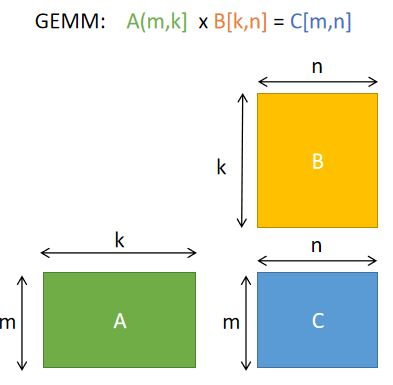

## AutoKernel实力展示：将GEMM的性能提升200倍!  

随着AI技术的快速发展，深度学习在各个领域得到了广泛应用。深度学习模型能否成功在终端落地应用，满足产品需求，一个关键的指标就是神经网络模型的推理性能。于是，一大波算法工程师为了算法的部署转岗算子优化工程师。然而，优化代码并不是一件简单的事，它要求工程师既要精通计算机体系架构，又要熟悉算法的计算流程，于是，稍微有经验的深度学习推理优化工程师都成了各家公司争抢的“香饽饽”。人才少，需求多，算子优化自动化是未来的大趋势。  
  
  
  
近日，致力于降低优化门槛，提升优化开发效率的算子自动优化工具AutoKernel正式开源了。  
  
  
  
____
### AutoKernel特色        
* 低门槛：无需底层优化汇编的知识门槛  
* 简单易用: 提供docker环境，无需安装环境，plugin一键集成到推理框架Tengine  
* 高效率: 无需手写优化汇编，一键生成优化代码，一键部署  

AutoKernel使用业界广泛使用的自动代码生成项目Halide，通过输入计算描述和调度策略，自动生成底层代码。AutoKernel支持以plugin的形式，将生成的自动优化算子一键部署到推理框架Tengine中。
_____
### GEMM优化教程          
下面，本教程将带领大家一步步优化矩阵乘法GEMM。无需手工撸代码，编写繁杂冗长的底层汇编代码，只需十几行简洁的调度代码。  
  
  
  
**两个优化宗旨：**           
在详细讲解优化步骤前，我们先谈谈优化的本质。我们在谈”优化“的时候，计算机底层做了什么？优化的”瓶颈“是什么？为什么通过一波”优化操作“，性能就能提升呢？AutoKernel使用的Halide是如何实现自动优化的呢？  
要解答这些疑问，我们需要了解一下硬件的基础的体系结构，了解硬件如何工作，才能在软件上实现算法的时候，尽可能去考虑利用硬件的一些特性，来做到高效的、极致的优化。  
  
  
   
上图是典型的存储理器层次结构：主存容量大，访问速度慢，寄存器和缓存读取速度快，但容量有限。在寄存器的层级上，CPU可以在一个时钟周期内访问它们，如果CPU去访问外部的DDR的话，延迟是非常大的，大概是200个时钟周期左右。如果CPU去访问cache的话，一般需要6到12个cycle就够了。所以，一个很重要的一个优化宗旨是：**优化内存访问**，充分利用寄存器和高速缓存去存数据。  
第二个优化宗旨是 **提高并行性** ：充分利用SIMD进行指令向量化和多核心并行。大部分现代CPU支持SIMD（Single Instruction Multiple Data，单指令流多数据流）。在同一个CPU循环中，SIMD可在多个值上同时执行相同的运算/指令。如果我们在4个数据点上进行向量化，一次计算四个数据，理论上就可以实现4倍的加速。
   
**运行环境搭建：**           
AutoKernel提供了docker镜像，docker里已经配置好运行环境，进入docker即可直接运行demo代码：  
```  
# 拉取镜像  
docker pull openailab/autokernel  
# 启动容器，进入开发环境  
docker run -it openailab/autokernel /bin/bash  
# 获取代码  
git clone https://github.com/OAID/AutoKernel.git  
cd AutoKernel/doc/tutorials/data/  
```  
   
目录下的build.sh是demo的执行脚本，运行需要指定优化步骤step，可选的step是从1 到7，其中step= 1 是默认不优化的，step=7是最极致优化的。        
**优化效果：**       
```   
# 执行demo  
./build.sh 1  
./build.sh 7   
```   
  
下图展示了在Intel(R) Core(TM) i9-9900K CPU @ 3.60GHz的电脑上的优化效果，无需手工撸代码，无需编写繁杂冗长的底层汇编代码，只需十几行简洁的调度代码, 就能性能优化200+倍。 
   
  
   
**下面是详细的优化步骤：**         
**STEP 1**            
第一个步骤是不带任何优化的。用Halide语言直接描述GEMM的计算过程。  
```   
1. Var x,y;
2. RDom k(0, K);
3. Func gemm("gemm");
4. gemm(x, y) += A(k, y) * B(x, k);
```  
计算M=N=K=640的矩阵乘法。运行脚本第一个参数指定step=1。耗时结果如下：  
```
root@bd3faab0f079:/AutoKernel/doc/tutorials/data# ./06_build.sh 1
step =  1
M N K = 640 640 640     err 0.00        [rep 50] autokernel | blas      240.8523 ms     1.1376 ms   
```   

**STEP 2**        
这一步我们采用分块tile。分块的目的是为了充分利用缓存。如果原来的循环较大，tile分块改成小块数据去计算，可以使得每次计算的数据都比较舒适地呆在缓存里，不用经历重复的驱逐（在缓存中重复的添加和删除数据)。分块后进行reorder操作，交换两个嵌套循环的顺序，目的是最内层的内存访问友好。我们按照x,y维度划分成16x8的小分块去计算：  
```   
1.	gemm.update()  
2.	    .tile(x, y, xo, yo, xi, yi, 16, 8)  
3.	    .reorder(xi, yi, k, xo, yo);  
```
   
执行结果     
```
root@bd3faab0f079:/AutoKernel/doc/tutorials/data# ./06_build.sh 2
step =  2
M N K = 640 640 640     err 0.00        [rep 50] halide | blas  81.8148 ms      1.1281 ms
```
> 性能从240ms优化到82ms，提升了近3倍。  
   
**STEP 3**        
我们在上一步的基础上增加向量化vectorize。向量化是把几个标量计算（scale)转换为一个向量计算（vector),充分利用SIMD向量指令。大部分现代CPU支持SIMD（Single Instruction Multiple Data，单指令流多数据流）。在同一个CPU循环中，SIMD可在多个值上同时执行相同的运算/指令。   
```   
1.	gemm.update()  
2.	       .tile(x, y, xo, yo, xi, yi, 16, 8)  
3.	       .reorder(xi, yi, k, xo, yo)  
4.	       .vectorize(xi, 8);  
```   

执行结果   
```   
root@bd3faab0f079:/AutoKernel/doc/tutorials/data# ./06_build.sh 3
step =  3
M N K = 640 640 640     err 0.00        [rep 50] autokernel | blas      27.5433 ms      1.1445 ms
```     
>性能从82ms优化到27ms，又加速了接近3倍。可以看到，围绕前面提到的两条优化宗旨：优化内存访问和提高并行性，从step1到step3，性能已经提升了近9倍。   
   
**STEP 4**          
调度策略在step3的基础上增加并行化parallel。对一个循环并行化是把循环的每次迭代分给多个线程或者处理器去同时处理，每个线程处理通过代码段（loop body),但是处理不同的数据。   
```   
1.	gemm(x, y) += A(k, y) * B(x, k);  
2.	gemm.update()  
3.	    .tile(x, y, xo, yo, xi, yi, 16, 8)  
4.	    .reorder(xi, yi, k, xo, yo)  
5.	    .vectorize(xi, 8)  
6.	    .parallel(yo); 
```    
执行结果    
```   
root@bd3faab0f079:/home/chunying/AutoKernel/doc/tutorials# ./06_build.sh 4
step =  4
M N K = 640 640 640     err 0.00        [rep 50] autokernel | blas      7.2605 ms       1.1605 ms
```   
> 增加并行化后，build.sh默认指定四线程，性能直接翻了近4倍，从27ms到7.3ms。   
   
**STEP 5**          
调度策略在上一步的基础上增加unroll展开。如果循环体内的语句没有数据相关依赖，循环展开可以增加并发执行的机会，使得更充分利用寄存器，减少循环时每个操作内存加载和保存的次数。   
```   
1.	gemm.update()  
2.	    .tile(x, y, xo, yo, xi, yi, 16, 8)  
3.	    .reorder(xi, yi, k, xo, yo)  
4.	    .vectorize(xi, 8)  
5.	    .parallel(yo)  
6.	    .unroll(xi)  
7.	    .unroll(yi,2);  
```   
执行结果   
```   
root@bd3faab0f079:/AutoKernel/doc/tutorials/data# ./06_build.sh 5
step =  5
M N K = 640 640 640     err 0.00        [rep 50] autokernel | blas      4.7617 ms       1.1597 ms
```   
> unroll展开后，性能从7.3ms优化到4.8ms。  

**STEP 6**          
前面的分块成 16 x 8的小kernel, 这一步先划分成 16 x 32的分块，然后把每个分块再分成 16 x 8的子分块。我们把最外层的两层循环合并到一层，并对这一层进行并行化。这一步计算描述多了一个prod函数来定义子分块的计算，prod函数的计算公式和总的gemm是一样的，我们通过 compute_at指定在 yi维度之下计算prod，则prod计算的是 16x8的小kernel, 大致逻辑如下：   
   
   
   
**总的代码如下：**   
```   
1.	Func prod;  
2.	prod(x, y) += A(k, y) * B(x, k);  
3.	gemm(x, y) = prod(x, y);  
4.	  
5.	gemm.tile(x, y, xi, yi, 16, 32)  
6.	    .fuse(x, y, xy).parallel(xy)  
7.	    .split(yi, yi, yii, 4)  
8.	    .vectorize(xi, 8)  
9.	    .unroll(xi)  
10.	    .unroll(yii);  
11.	  
12.	prod.compute_at(gemm, yi)  
13.	    .vectorize(x, 8).unroll(y);  
14.	  
15.	prod.update()  
16.	    .reorder(x, y, k)  
17.	    .vectorize(x, 8)  
18.	    .unroll(x)  
19.	    .unroll(y)  
20.	    .unroll(k, 2);
```   
执行结果   
```  
root@bd3faab0f079:/AutoKernel/doc/tutorials/data# ./06_build.sh 6
step =  6
M N K = 640 640 640     err 0.00        [rep 50] autokernel | blas      3.1824 ms       1.1373 ms
```  
> 这一步距离STEP1性能已经优化了近80倍了，性能越来越接近OpenBlas了。   

**STEP 7**            
这一步添加的操作是对矩阵B进行数据重排，使得在计算小kernel 16x8时，内存读取更顺畅。因为小kernel的x维度是按照16划分的，因此重排数据B的x维度也是按照16重排。   
   
   
  
**总的代码如下：**   
```   
1.	Func B_interleave("B"), Bs("Bs");  
2.	Bs(x, y, xo) = B(xo * 16 + x, y);  
3.	B_interleave(x, y) = Bs(x % 16, y, x / 16);  
4.	  
5.	Func prod;  
6.	prod(x, y) += A(k, y) * B_interleave(x, k);  
7.	gemm(x, y) = prod(x, y);  
8.	  
9.	gemm.tile(x, y, xi, yi, 16, 32)  
10.	    .fuse(x, y, xy).parallel(xy)  
11.	    .split(yi, yi, yii, 4)  
12.	    .vectorize(xi, 8)  
13.	    .unroll(xi)  
14.	    .unroll(yii);  
15.	  
16.	prod.compute_at(gemm, yi)  
17.	    .vectorize(x, 8).unroll(y);  
18.	  
19.	prod.update()  
20.	    .reorder(x, y, k)  
21.	    .vectorize(x, 8)  
22.	    .unroll(x)  
23.	    .unroll(y)  
24.	    .unroll(k, 2);  
25.	Bs.compute_root()  
26.	    .split(y, yo, yi, 16)  
27.	    .reorder(x, yi, xo, yo)  
28.	    .unroll(x)  
29.	    .vectorize(yi).parallel(yo, 4);  
```   
执行结果   
```
root@bd3faab0f079:/AutoKernel/doc/tutorials/data# ./06_build.sh 7
step =  7
M N K = 640 640 640     err 0.00        [rep 50] autokernel | blas      1.1957 ms       1.1425 ms
```   

至此，我们的每一步调优策略始终都围绕两条优化宗旨“优化内存访问”，“提高并行性”展开优化，到最后性能已经与OpenBlAS差不多了，距离STEP1已经加速了200+倍了。
